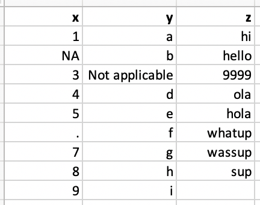

```{r setup, include=FALSE}
library(learnr)
library(testwhat)
library(magrittr)

tutorial_options(
  exercise.timelimit = 60,
  exercise.checker = testwhat::testwhat_learnr
)
knitr::opts_chunk$set(comment = NA)
```

## Disclaimer

This tutorial is in many parts built from tutorials published on GitHub by RStudio and its Education team, mainly from their [2-day internal R bootcamp](https://github.com/rstudio-education/bootcamper) and from the [RStudio Cloud primers](https://github.com/rstudio-education/primers).

## Reading rectangular data

### The [**readr**](https://readr.tidyverse.org) and [**readxl**](https://readxl.tidyverse.org) packages


- `readr::read_csv()` - comma delimited files;
- `readr::read_csv2()` - semicolon separated files (common in countries where , is used as the decimal place);
- `readr::read_tsv()` - tab delimited files;
- `readr::read_delim()` - reads in files with any delimiter;
- `readxl::read_excel()` - reads `.xls` and `.xlsx` files;
- ...

### Reading and summarizing data - The [**skimr**](https://docs.ropensci.org/skimr) package


```{r read-csv}
nobel <- readr::read_csv(file = "www/nobel.csv")
```

```{r skim}
skimr::skim(nobel)
```

The [**skimr**](https://docs.ropensci.org/skimr/) package provides a frictionless approach to summary statistics which conforms to the principle of least surprise, displaying summary statistics the user can skim quickly to understand their data. It handles different data types and returns a skim_df object which can be included in a pipeline or displayed nicely for the human reader.

### Writing data

```{r write-csv, exercise=TRUE}
df <- tibble::tribble(
  ~x, ~y,
  1,  "a",
  2,  "b",
  3,  "c"
)

list.files()
readr::write_csv(df, path = "df.csv")
list.files()
# For Unix systems:
# writeLines(system("head -n 3 df.csv", intern = TRUE))
# For Windows:
# writeLines(system("gc df.csv | select -first 3", intern = TRUE))
```

```{r write-csv-setup}
if (file.exists("df.csv"))
  file.remove("df.csv")
```

### Exercise

- Import the data stored at path `www/nobel.csv`;
- Create a new tibble, `nobel_stem`, that filters for the STEM fields (Physics, Medicine, Chemistry, and Economics);
- Create another tibble, `nobel_nonstem`, that filters for the remaining fields;
- Write out the two data frames to `nobel-stem.csv` and `nobel-nonstem.csv`;
- Check that they are written correctly.

```{r ex-csv, exercise=TRUE}

```

```{r ex-csv-setup}
dir.create("www")
download.file(
  url = "https://github.com/astamm/teachr/raw/master/inst/tutorials/03_DataImport/www/nobel.csv", 
  destfile = "www/nobel.csv", 
  mode = "wb"
)
```

<div id=ex-csv-hint>
**Hint:** Use the `%in%` operator when filtering.
</div>

## Variable names

```{r variable-names}
edi_airbnb <- readr::read_csv(file = "www/edi-airbnb.csv")
names(edi_airbnb)
```

... but R doesn't allow spaces in variable names:

```{r space-names, error=TRUE}
edi_airbnb$Number of bathrooms
```

### Option 1 - Quote \` \` variable names

```{r names-o1, results='hide'}
edi_airbnb$`Number of bathrooms`
```

### Option 2 - Define column names

```{r names-o2}
edi_airbnb_col_names <- readr::read_csv(
  file = "www/edi-airbnb.csv", 
  col_names = c(
    "id", "price", "neighbourhood", 
    "accommodates", "bathroom", "bedroom", 
    "bed", "review_scores_rating", 
    "n_reviews", "url"
  )
)

names(edi_airbnb_col_names)
```

### Option 3 - Format text to `snake_case`


```{r names-o3}
edi_airbnb_cleaned_names <- edi_airbnb %>%
  janitor::clean_names()

names(edi_airbnb_cleaned_names)
```

The [**janitor**](http://sfirke.github.io/janitor/) package has simple functions for examining and cleaning dirty data. It was built with beginning and intermediate R users in mind and is optimized for user-friendliness. Advanced R users can already do everything covered here, but with janitor they can do it faster and save their thinking for the fun stuff. The main functions:

- perfectly format tibble column names;
- create and format frequency tables of one, two, or three variables; 
- isolate partially-duplicate records.

## Variable types

Suppose you have some data stored in a CSV file that looks like this:

```{r img-df-na, echo=FALSE}

```

Let us import it in our R session:

```{r import-df-na}
readr::read_csv("www/df-na.csv")
```

What is the type of the different variables ? Is it what you expected ?

### Option 1 - Explicit NAs

A first solution is to use the argume `na` to explicitly list all values in the file that should be considered as `NA`:

```{r explicit-na}
readr::read_csv(
  file = "www/df-na.csv", 
  na = c("", "NA", ".", "9999", "Not applicable")
)
```

### Option 2 - Specify column types

```{r spec-coltypes}
readr::read_csv(
  file = "www/df-na.csv", 
  col_types = list(
    readr::col_double(), 
    readr::col_character(), 
    readr::col_character()
  )
)
```

### Column types

**type function**  | **data type**
------------------ | -------------
`col_character()`  | character
`col_date()`       | date
`col_datetime()`   | POSIXct (date-time)
`col_double()`     | double (numeric)
`col_factor()`     | factor
`col_guess()`      | let readr guess (default)
`col_integer()`    | integer
`col_logical()`    | logical
`col_number()`     | numbers mixed with non-number characters
`col_numeric()`    | double or integer
`col_skip()`       | do not read
`col_time()`       | time

### Exercise 1

- Read in the Excel file at path `www/favourite-food.xlsx`;
- Clean up `NA`s and make sure you're happy with variable types;
- Convert SES (socio economic status) to a factor variables with levels in the following order: `Low`, `Middle`, `High`;
- Write out the resulting data frame to the path `favourite-food.csv`;
- Finally, read `favourite-food.csv` back in and observe the variable types. Are they as you left them?

```{r fav-food-csv, exercise=TRUE}

```

```{r fav-food-csv-setup}
dir.create("www")
download.file(
  url = "https://github.com/astamm/teachr/raw/master/inst/tutorials/03_DataImport/www/favourite-food.xlsx", 
  destfile = "www/favourite-food.xlsx", 
  mode = "wb"
)
```

### `read_rds()` and `write_rds()`

- CSVs can be unreliable for saving interim results if there is specific variable type information you want to hold on to;
- An alterive is RDS files, you can read and write them with `read_rds()` and `write_rds()`, respectively.

```{r rds, eval=FALSE}
readr::read_rds(path)
readr::write_rds(x, path)
```

### Exercise 2

- Repeat the first three steps from Exercise 1;
- Write out the resulting tibble to `favourite-food.rds`;
- Read `favourite-food.rds` back in and observe the variable types.  Are they as you left them?

```{r fav-food-rds, exercise=TRUE}

```

```{r fav-food-rds-setup}
dir.create("www")
download.file(
  url = "https://github.com/astamm/teachr/raw/master/inst/tutorials/03_DataImport/www/favourite-food.xlsx", 
  destfile = "www/favourite-food.xlsx", 
  mode = "wb"
)
```

### Exercise 3

The `sales` data set (located at `www/sales.xlsx`) looks like this:

```{r sales, echo=FALSE}
readxl::read_excel("www/sales.xlsx")
```

Read it using appropriate arguments for the `readxl::read_excel()` function such that it looks like the following:

```{r sales-format, echo=FALSE}
sales <- readxl::read_excel(
  path = "www/sales.xlsx", 
  skip = 3, 
  col_names = c("id", "n")
)
sales
```

```{r sales-exo, exercise=TRUE}

```

```{r sales-exo-setup}
dir.create("www")
download.file(
  url = "https://github.com/astamm/teachr/raw/master/inst/tutorials/03_DataImport/www/sales.xlsx", 
  destfile = "www/sales.xlsx", 
  mode = "wb"
)
```

## Other types of data

- **haven**: SPSS, Stata, and SAS files
- **DBI**, along with a database specific backend (e.g. RMySQL, RSQLite, RPostgreSQL etc): allows you to run SQL queries against a database and return a data frame
- **jsonline**: JSON
- **xml2**: xml
- **rvest**: web scraping
- **httr**: web APIs
- **sparklyr**: data loaded into spark

## Missing Values


As stated in the description of the [**naniar**](http://naniar.njtierney.com) package, missing values are ubiquitous in data and need to be explored and handled in the initial stages of analysis.

### Visualizing missing values

The [**naniar**](http://naniar.njtierney.com) package provides data structures and functions that facilitate the plotting of missing values and examination of imputations. This allows missing data dependencies to be explored with minimal deviation from the common work patterns of 'ggplot2' and tidy data.

You can always decide to discard any observation that would contain a missing value, but this strategy is often not optimal as you might reduce drastically your sample size and come to weak statistical conclusions. A better strategy pertains to doing imputation.

### Imputing missing values

Imputation means replacing missing values by actual values using the available non-missing data. For imputation, we recommend the packages [**Amelia**](https://gking.harvard.edu/amelia), [**mice**](https://stefvanbuuren.name/mice/) and [**miceFast**](https://github.com/Polkas/miceFast). In particular, the `Amelia::amelia()` and `mice::mice()` functions provide a very easy way to perform multiple imputation on a data set.

The [**miceFast**](https://github.com/Polkas/miceFast) package has a slightly more complex syntax to achieve the same results provided by the [**mice**](https://stefvanbuuren.name/mice/) package. However, it is a complete re-implementation of the [**mice**](https://stefvanbuuren.name/mice/) package from scratch using C++, which comes with $2$ big advantages:

1. it has very few package dependencies;
1. it is considerably much faster.

It is therefore recommended for those who do not like many dependencies to be installed on their computer or for those who need to perform multiple imputation on big data sets.

Note finally that there are many other packages for handling [missing values](https://cran.r-project.org/web/views/MissingData.html).
