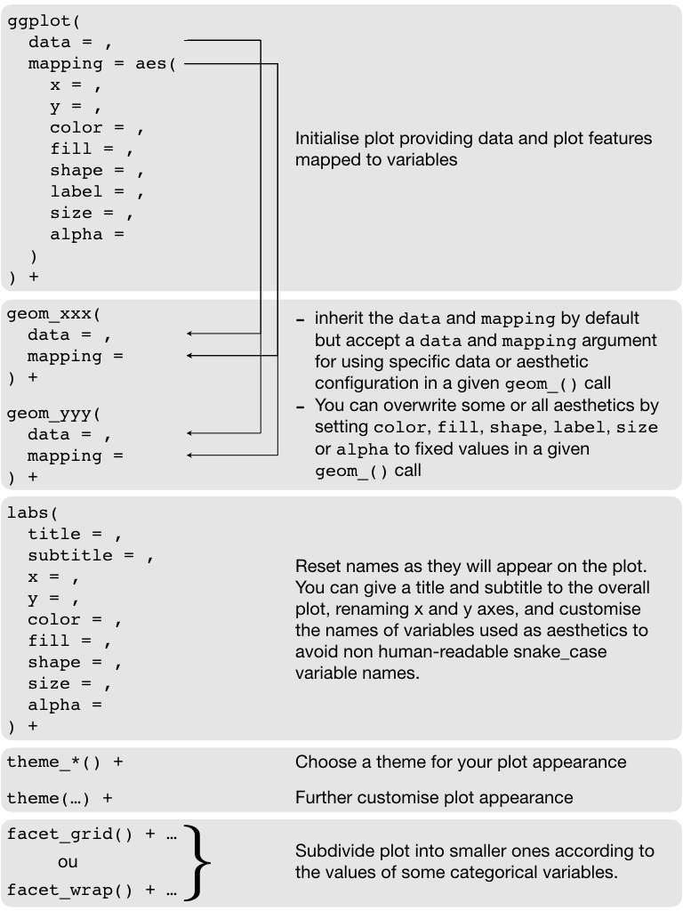

```{r setup, include=FALSE}
library(learnr)
library(testwhat)
library(magrittr)
library(ggplot2)
starwars <- dplyr::starwars

options(repos = "https://cloud.r-project.org")
tutorial_options(
  exercise.timelimit = 60,
  exercise.checker = testwhat::testwhat_learnr
)
knitr::opts_chunk$set(comment = NA)
```

## Purpose

### Disclaimer

This tutorial is in parts built from RStudio [2-day internal R bootcamp](https://github.com/rstudio-education/bootcamper).

### Visualisation

> *The simple graph has brought more information to the data analyst’s mind than any other device.* — John Tukey

- Data visualization is the creation and study of the visual representation of data.
- There are many tools for visualizing data (R is one of them), and many approaches/systems within R for making data visualizations ([**ggplot2**](https://ggplot2.tidyverse.org) is one of them, and that is what we are going to use).

## The [**ggplot2**](https://ggplot2.tidyverse.org) package


### Introduction

Powerful and complex data visualisations can be achieved in a systematic fashion using the
[**ggplot2**](https://ggplot2.tidyverse.org) package, which implements a **grammar of graphics** that enables us to concisely describe the components of a graphic.

**Notes:**

- Contrary to what we prescribed, we will deliberately import all functions from [**ggplot2**](https://ggplot2.tidyverse.org) into our R session so that we do not have to repeatedly write `ggplot2::` in front of each function from [**ggplot2**](https://ggplot2.tidyverse.org) that we call. This is because, when it comes to plotting, an enormous quantity of [**ggplot2**](https://ggplot2.tidyverse.org) functions are used so the code would become unnecessarily complex if we decided not to import [**ggplot2**](https://ggplot2.tidyverse.org);
- Similarly, we will illsutrate the features of [**ggplot2**](https://ggplot2.tidyverse.org) using the `dplyr::starwars`, so we will extract it from [**dplyr**](https://dplyr.tidyverse.org) to be able to access it by simply calling `starwars`.

Both of these tasks are performed by the following lines of code:

```{r viz-setup, eval=FALSE}
library(ggplot2)
starwars <- dplyr::starwars
```

Let us start by looking at this grammar syntax from an example. We first plot the mass of each character against their height:

```{r ggplot-first, fig.align='center'}
ggplot(data = starwars, mapping = aes(x = height, y = mass)) +
  geom_point()
```

What does the following modification achieve?

```{r ggplot-second, fig.align='center', exercise=TRUE}
ggplot(data = starwars, mapping = aes(x = height, y = mass)) +
  geom_point() +
  geom_smooth()

```

**Note:** When constructing a plot, you do not apply consectutive processes to an original data set. Rather, you want to **add** layers for plotting different data representations. The operator to **add** layers is therefore the natural `+` addition operator and **not** the `%>%` pipe operator.

### Visual identification of outliers

Look at the list of available `geom_*()` functions [here](https://ggplot2.tidyverse.org/reference/index.html) to find a function that allows you to add labels to each point in order to visually spot who is the fattest character who seems on their own on the top of the plot. Modify the following code accordingly:

```{r spot-jabba-labels, exercise=TRUE}
ggplot(data = starwars, mapping = aes(x = height, y = mass)) +
  geom_point()

```

Are you satisfied with the way names are added to the plot? Investigate the package [**ggrepel**](https://ggrepel.slowkow.com) to see if you can find functions that might help obtaining a better visual representation. Again, modify the following code accordingly:

```{r spot-jabba-repel, exercise=TRUE}
ggplot(data = starwars, mapping = aes(x = height, y = mass)) +
  geom_point()

```

Is it enough? How about adding just the name of the fattest character then? Again, modify the following code accordingly: 

```{r spot-jabba-label, exercise=TRUE}
ggplot(data = starwars, mapping = aes(x = height, y = mass)) +
  geom_point()

```

### The `ggplot2` structure

- `ggplot()` is the main function in [**ggplot2**](https://ggplot2.tidyverse.org)
- Plots are constructed in layers
- Structure of the code for plots can be summarized by the following scheme:

```{r ggplot-structure, echo=FALSE, fig.align='center'}

```

### Visualising Star Wars

Let us use what we learnt so far to take a look at the summary of the data:

```{r starwars-skim}
skimr::skim(starwars)
```

Substantially, a number of features are reported for each character appearing in the Star Wars movies. The following image illustrates on Luke Skywalker the measured variables:

```{r luke, echo=FALSE, fig.align='center'}
knitr::include_graphics("images/luke-skywalker.png")
```

**Note:** Data sets are also documented in R packages. This means that you can also invoke the help function on data sets and not only on functions. You can thus have information about a package data set using, e.g., `?dplyr::starwars`.

**Your turn:** The following code plots the mass against the height. Change the variables assigned to the `x` and `y` axes to see the distributions of other variables and see what happens:

```{r ggplot-first-experience, exercise=TRUE, exercise.lines=10, fig.align='center'}
ggplot(data = starwars, mapping = aes(x = height, y = mass)) +
  geom_point()

```

### Specifying labels

You can give your plot a proper title and subtitle, specify axis labels and rename the variables mapped to aesthetics with more human-readable names. This is the job of the `labs()` function:

```{r ggplot-labs, fig.align='center'}
ggplot(data = starwars, mapping = aes(x = height, y = mass)) +
  geom_point() +
  labs(
    title = "Mass vs. height of Starwars characters", 
    x = "Height (cm)", 
    y = "Weight (kg)"
  )
```

## Aesthetics

Visual characteristics of plotting characters that can be mapped to a specific variable in the data are:

- linetype
- label
- shape
- colour
- fill
- size
- alpha (transparency)

There are two types of variables:

- Continuous variable are measured on a continuous scale
- Discrete variables are measured (or often counted) on a discrete scale

Mapping continuous or discrete variables to the previous aesthetics will behave differently:

aesthetics    | discrete                             | continuous
------------- | ------------------------------------ | ------------
linetype      | type of line for each (small number) | *shouldn't be used*
label         | value for each (converted to text)   | *shouldn't be used*
shape         | different shape for each             | *shouldn't (and doesn't) work*
color         | rainbow of colors                    | gradient
fill          | rainbow of colors                    | gradient
size          | discrete steps                       | linear mapping between radius and value
alpha         | *shoudn't be used*                   | linear mapping between radius and value

You might also want to set these features to fixed values, **not** depending on a variable:

- Use aesthetics for mapping features of a plot to a variable;
- Define the features directly in the `geom_*()` function for customization **not** mapped to a variable.

### Color

```{r aes-version1, fig.align='center'}
ggplot(
  data = starwars, 
  mapping = aes(
    x = height, 
    y = mass, 
    color = gender
  )
) +
  geom_point()
```

### Color + Size

- Using a fixed point size:

```{r aes-version2, fig.align='center'}
ggplot(
  data = starwars, 
  mapping = aes(
    x = height, 
    y = mass, 
    color = gender
  )
) +
  geom_point(size = 2)
```

- Using the variable `birth_year` mapped to the`size` aesthetic:

```{r aes-version3, fig.align='center'}
ggplot(
  data = starwars, 
  mapping = aes(
    x = height, 
    y = mass, 
    color = gender, 
    size = birth_year
  )
) +
  geom_point()
```

Let us prep this last plot for reporting using a more complex piece of code:

```{r aes-version4, fig.align='center'}
ggplot(
  data = starwars, 
  mapping = aes(
    x = height, 
    y = mass, 
    color = gender, 
    size = birth_year
  )
) +
  geom_point(alpha = 0.7) +
  labs(
    title = "Mass vs. height of Starwars characters",
    subtitle = "by gender and birth year",
    x = "Height (cm)", 
    y = "Weight (kg)",
    color = "Gender",
    size = "Birth year"
  ) +
  theme_minimal() +
  theme(
    legend.direction = "horizontal", 
    legend.position = "bottom", 
    legend.box = "vertical"
  )
```

## Faceting

- Smaller plots that display different subsets of the data
- Useful for exploring conditional relationships and large data

You have two functions in [**ggplot2**](https://ggplot2.tidyverse.org/index.html) to do that:

- [`facet_grid()`](https://ggplot2.tidyverse.org/reference/facet_grid.html): Lay out panels in a grid;
- [`facet_wrap()`](https://ggplot2.tidyverse.org/reference/facet_wrap.html): Wrap a 1d ribbon of panels into 2d.

```{r faceting, fig.align='center'}
ggplot(data = starwars, mapping = aes(x = height, y = mass)) +
  facet_grid(cols = vars(gender)) +
  geom_point() +
  labs(
    title = "Mass vs. height of Starwars characters", 
    subtitle = "Faceted by gender"
  ) + 
  theme(aspect.ratio = 1)
```

**Important:** Take a close look at the syntax to specify the facetting variables. They need to be specified within a call to the function `vars()`. This is how [**ggplot2**](https://ggplot2.tidyverse.org/index.html) knows that it should find the variables in the data set associated with the current plot.

**Your turn.** Now check out the online help of the [facet_grid()](https://ggplot2.tidyverse.org/reference/facet_grid.html) and [facet_wrap()](https://ggplot2.tidyverse.org/reference/facet_wrap.html) functions to solve the following exercises.

**Exercise 1.** Modify the code to have each subplot with its own x-axis scale:

```{r faceting-exo1, fig.align='center', exercise=TRUE}
ggplot(data = starwars, mapping = aes(x = height, y = mass)) +
  facet_grid(cols = dplyr::vars(gender)) +
  geom_point() +
  labs(
    title = "Mass vs. height of Starwars characters", 
    subtitle = "Faceted by gender"
  ) + 
  theme(aspect.ratio = 1)

```

**Exercise 2.** Modify the code to have each subplot displayed in a single column rather than in a single row:

```{r faceting-exo2, fig.align='center', exercise=TRUE}
ggplot(data = starwars, mapping = aes(x = height, y = mass)) +
  facet_grid(cols = dplyr::vars(gender)) +
  geom_point() +
  labs(
    title = "Mass vs. height of Starwars characters", 
    subtitle = "Faceted by gender"
  ) + 
  theme(aspect.ratio = 1)

```

**Exercise 3.** Modify the code to use `eye_color` instead of `gender` for facetting. What is the difference between `facet_grid` and `facet_wrap`? Which one is it better to use in this case?

```{r faceting-exo3, fig.align='center', exercise=TRUE}
ggplot(data = starwars, mapping = aes(x = height, y = mass)) +
  facet_grid(cols = dplyr::vars(gender)) +
  geom_point() +
  labs(
    title = "Mass vs. height of Starwars characters", 
    subtitle = "Faceted by gender"
  ) + 
  theme(aspect.ratio = 1)

```

**Exercise 4.** Modify the code to use `hair_color` **and** `gender` for facetting.

```{r faceting-exo4, fig.align='center', exercise=TRUE}
ggplot(data = starwars, mapping = aes(x = height, y = mass)) +
  facet_grid(cols = dplyr::vars(gender)) +
  geom_point() +
  labs(
    title = "Mass vs. height of Starwars characters", 
    subtitle = "Faceted by gender"
  ) + 
  theme(aspect.ratio = 1)

```

## Visualizing variation

### Numerical data

#### Histogram

```{r histogram, fig.align='center'}
ggplot(data = starwars, mapping = aes(x = height)) + 
  geom_histogram(binwidth = 10)
```

#### Density plot

```{r density, fig.align='center'}
ggplot(data = starwars, mapping = aes(x = height)) +
  geom_density()
```

#### Box plot

```{r boxplot, fig.align='center'}
ggplot(data = starwars, mapping = aes(y = height)) +
  geom_boxplot()
```

### Categorical data: the bar plot

```{r barplot, fig.align='center'}
ggplot(data = starwars, mapping = aes(x = gender)) +
  geom_bar()
```

## Visualizing co-variation

### Numerical and categorical data

#### Color-filled histograms?

```{r histogram-mix, fig.align='center'}
ggplot(data = starwars, mapping = aes(x = height, fill = gender)) +
  geom_histogram(
    binwidth = 10, 
    position = position_dodge2(), 
    color = "black"
  )
```

This representation is not really helpful because adjusting a unique binning parameter appropriate for all histograms is rarely possible.

#### Color-filled densities

```{r density-mix, fig.align='center'}
ggplot(data = starwars, mapping = aes(x = height, fill = gender)) +
  geom_density(color = "black", alpha = 0.3)
```

#### Side-by-side box plots

```{r boxplot-mix, fig.align='center'}
ggplot(data = starwars, mapping = aes(y = height, x = gender)) +
  geom_boxplot()
```

#### Scatter plot?

```{r scatter, fig.align='center'}
ggplot(data = starwars, mapping = aes(y = height, x = gender)) +
  geom_point()
```

This is not a great representation of these data. Why?

#### Violin plots

```{r violon, fig.align='center'}
ggplot(data = starwars, mapping = aes(y = height, x = gender)) +
  geom_violin()
```

### Both categorical data

#### Segmented bar plots, counts

```{r barplot-seg1, fig.align='center'}
ggplot(
  data = starwars, 
  mapping = aes(x = gender, fill = hair_color)
) +
  geom_bar(position = position_stack())
```

#### Recode hair color

Using the `fct_other()` function from the [**forcats**](https://forcats.tidyverse.org) package, which is also part of the **tidyverse**.

```{r hair-color}
starwars <- starwars %>%
  dplyr::mutate(
    hair_color2 = forcats::fct_other(
      f = hair_color, 
      keep = c("black", "blond", "brown", "white")
    )
  )
```

#### Segmented bar plots, counts

```{r barplot-seg2, fig.align='center'}
ggplot(
  data = starwars, 
  mapping = aes(x = gender, fill = hair_color2)
) +
  geom_bar(position = position_stack()) +
  coord_flip()
```

#### Segmented bar plots, proportions

```{r barplot-seg3, fig.align='center'}
ggplot(
  data = starwars, 
  mapping = aes(x = gender, fill = hair_color2)
) +
  geom_bar(position = position_fill()) +
  coord_flip() + 
  labs(y = "proportion")
```

#### Nested bar plots

**Version 1:** Explore how the hair color is distributed within each gender category.

```{r barplot-nested1, fig.align='center'}
ggplot(
  data = starwars, 
  mapping = aes(x = gender, fill = hair_color2)
) +
  geom_bar(position = position_dodge2(preserve = "single"))
```

**Version 2:** Explore how gender is distributed within each hair color category.

```{r barplot-nested2, fig.align='center'}
ggplot(
  data = starwars, 
  mapping = aes(x = hair_color2, fill = gender)
) +
  geom_bar(position = position_dodge2(preserve = "single"))
```

**Your turn:** Why all bar plots do not have the same number of bars? How could you remedy?

```{r barplot-exo, fig.align='center', exercise=TRUE}

```

<div id="barplot-exo-hint">
**Hint:** 

1. Combine [dplyr::count()](https://dplyr.tidyverse.org/reference/tally.html) and [tidyr::complete()](https://tidyr.tidyverse.org/reference/complete.html) to manually perform the counting and avoid dropping combinations with zero count.
2. Use `stat = "identity"` as an argument to the `geom_bar()` since you do not need [**ggplot2**](https://ggplot2.tidyverse.org) to perform the counting behind the scene as you already did it.
</div>

## Visualization in higher dimensions

### [**ggplot2**](https://ggplot2.tidyverse.org) extensions

The ggplot2 package is now widely used worldwide. As a result, a number of people have been developing extensions to perform all kinds of plots. It is highly probable that, if you do not manage to draw a plot you have on your mind easily with your knowledge of ggplot2, then someone probably has published an extension already that perfectly fits your needs. You can  consult at any time the up-to-date list of [ggplot2 extensions](https://www.ggplot2-exts.org).

### Heatmaps

You can visualize a third dimension by color-coding a 2D plane. This is what does a heatmap. There are several ways to draw heatmaps in R. We recommend the [**d3heatmap**](https://github.com/rstudio/d3heatmap) package which provides interactive heatmaps.

### Data visualization of 3D data in 3D

Lots of packages offer 3D visualization tools. We recommend the [**plot3D**](https://cran.r-project.org/web/packages/plot3D/index.html) package, which is particularly well implemented and easy to use. A nice introductory tutorial can be found [here](http://www.sthda.com/english/wiki/impressive-package-for-3d-and-4d-graph-r-software-and-data-visualization).

### Visualizing nD data


Visualization of nD data seems impossible on paper. One way to actually do this is to visualize projections of the nD data into $\mathbb{R}$, $\mathbb{R}^2$ or $\mathbb{R}^3$. You then create a *tour* of your data by generating a smooth sequence of projections and display your data as a movie. In R, this is easily achieved by the [**tourr**](http://ggobi.github.io/tourr/) package.

To demonstrate this technique we will use a data set in the [**tourr**](http://ggobi.github.io/tourr/) package called `flea`, which contain measurements of flea beetle characteristics for 3 different species:

```{r flea}
skimr::skim(tourr::flea)
```

Displaying data as a movie cannot be performed within a tutorial, so let's open **another RStudio application** to run the following code:

```{r tourr, eval=FALSE}
# macOS and Linux
quartz()
# Windows
# X11()
tourr::animate_xy(
  data = tourr::flea[, -7],
  col = tourr::flea[, 7]
)
```

## Exercise

The values of two numerical variables `x` and `y` has been collected in 13 different situations. The data is available for you under the name `experiment` as a tibble.

```{r prepare-experiment, echo=FALSE}
experiment <- datasauRus::datasaurus_dozen_wide
```

1. Transform the data so as to make it tidy.

```{r experiment-tidy, exercise=TRUE, exercise.setup = "prepare-experiment"}

```

2. Calculate the mean and standard deviation of both `x` and `y` as well as their correlation, for each of the 13 situations.

```{r experiment-summarise, exercise=TRUE, exercise.setup = "prepare-experiment"}

```

<div id="experiment-summarise-hint">
**Hint:** Use `mean()` to compute the mean, `sd()` to compute the standard deviation and `cor()` to compute the correlation.
</div>

3. Create a visualization of `y` vs. `x`, for each of the 13 situations. How similar or different are the data collected in the different situations?

```{r experiment-plot, exercise=TRUE, exercise.setup = "prepare-experiment", fig.align='center'}

```
