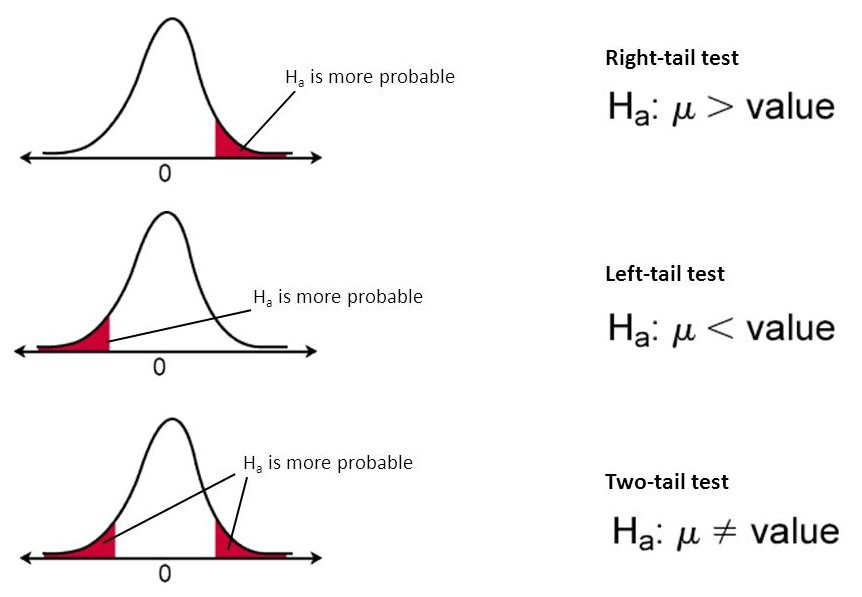

```{r setup, include=FALSE}
library(learnr)
library(testwhat)
library(magrittr)

options(repos = "https://cloud.r-project.org")
tutorial_options(
  exercise.timelimit = 60,
  exercise.checker = testwhat::testwhat_learnr
)
knitr::opts_chunk$set(comment = NA)
```

## Setup

- You have some data $\{x_1, \dots, x_n\}$ that you presume have been sampled from corresponding random variables $\{X_1, \dots, X_n\}$;
- You formulate a simple hypothesis $H_0$, called *null* hypothesis, about the population(s) from which the data have been extracted;
- You want to confront this hypothesis against an *alternative* hypothesis $H_1$ using your limited amount of data;
- You use a *test statistic* $T(X_1, \dots, X_n)$ that depends on the sample (and thus that you can calculate anytime you observe the sample) and of which you know (an approximation of) the distribution when you assume that your null hypothesis is true; it is called the **null distribution** of the test statistic $T$;
- You calcule the value $t_0$ of this test statistic with your observed data;
- You strongly reject $H_0$ if $t_0$ falls on the tails of the null distribution of $T$; **or**,
- You lack evidence to reject $H_0$ if $t_0$ ends up in the central part of the null distribution of $T$.

**Warning.** It is straightforward from this setup to understand that the problem is not symmetric in the hypotheses. Indeed, the procedure relies on what happens when $H_0$ is true but does not depend on $H_1$.

## Methodology

### Test statistic

You design a *test statistic* $T(X_1, \dots, X_n)$ for the purpose of performing this test which must satisfy at least the first three of the following four properties:

  1. It evaluates to real values;
  1. You have all the required knowledge to compute its value once you observe the data;
  1. **If $H_0$ is true**, then small values of the statistic should comfort you with the idea that $H_0$ is a reasonable assumption, while larger values of the statistic should generate suspicion about $H_0$ **in favor** of the alternative hypothesis $H_1$;
  1. **If $H_0$ is true**, then it can be very helpful to have access to the (asymptotic) distribution of the test statistic under *classical* assumptions (such as normality).
  
*Example: Test on the mean.* Suppose you have a sample of $n$ *i.i.d.* random variables $X_1, \dots, X_n \sim \mathcal{N}(\mu, \sigma^2)$ and you know the value of $\sigma^2$. We want to test whether the mean $\mu$ of the distribution is equal to some pre-specified value $\mu_0$. We can therefore use $H_0: \mu = \mu_0$ vs. $H_1: \mu \ne \mu_0$. At this point, a good candidate test statistic to look at for performing this test is:

$$ T(X_1, \dots, X_n) := \sqrt{n} \frac{\overline X - \mu_0}{\sigma}, \quad \mbox{with} \quad \overline X := \frac{1}{n} \sum_{i=1}^n X_i. $$

Indeed,

- it evaluates to real values;
- you have all the required knowledge to compute its value once you observe the data and thus have access to $\overline x$;
- the sample mean $\overline X$ is an unbiased estimator of the true unknown mean $\mu$; so, if $H_0$ is true, then $\overline X$ will produce values that are close to $\mu_0$; hence, small values of $T$ will comfort you with the idea that $H_0$ is a reasonable assumption, while larger values, both positive or negative, of the statistic should generate suspicion about $H_0$ **in favor** of the alternative hypothesis $H_1$;
- if you assume normality and independence of the sample, then $T \sim \mathcal{N}(0, 1)$.

### Distribution of the test statistic under the null hypothesis

If you designed your test statistic carefully, you might have access to its theoretical distribution when $H_0$ is true under strong distributional assumptions about the data. This is called **parametric** hypothesis testing.

If it is not the case, you can often derive the theoretical distribution of the statistic under the null hypothesis asymptotically, i.e. assuming that you have a large sample ($n \gg 1$); this is called **asymptotic** hypothesis testing.

If you are in a large sample size regime but still cannot have access to the theoretical distribution of your test statistic, you can approach this distribution using bootstrapping; this is called **bootstrap** hypothesis testing.

If you are in a low sample size regime, then you can approach the distribution of the test statistic using permutations; this is called **permutation** hypothesis testing.

### Two-sided vs. one-sided hypothesis tests

Depending on what you put into the alternative hypothesis $H_1$, larger values of the test statistic that raise suspicion regarding the validity of $H_0$ might mean:

- larger values only on the right tail of the null distribution of $T$;
- larger values only on the left tail of the null distribution of $T$;
- larger values on both tails.

In the first two cases, we say that the test is **one-sided**. In the latter case, we say that the test is **two-sided** because we interpret large values in both tails as suspicious.

*Example: Test on the mean.* Suppose you have a sample of $n$ *i.i.d.* random variables $X_1, \dots, X_n \sim \mathcal{N}(\mu, \sigma^2)$ and you know the value of $\sigma^2$. We want to test whether the mean $\mu$ of the distribution is equal to some pre-specified value $\mu_0$. As we have since, a good candidate test statistic to look at for performing this test is:

$$ T(X_1, \dots, X_n) := \sqrt{n} \frac{\overline X - \mu_0}{\sigma}, \quad \mbox{with} \quad \overline X := \frac{1}{n} \sum_{i=1}^n X_i. $$

Now, using this test statistic, we might be interested in performing three different tests:

1. $H_0: \mu = \mu_0$ vs. $H_1: \mu > \mu_0$;
1. $H_0: \mu = \mu_0$ vs. $H_1: \mu < \mu_0$;
1. $H_0: \mu = \mu_0$ vs. $H_1: \mu \ne \mu_0$.

Remember that we must look at large values of $T$ that raise suspicion **in favor** of $H_1$. 
```{r null-distri, echo=FALSE, fig.align='center'}

```

- In Scenario 1, large negative values of $T$ happen when the true mean (estimated with no bias by $\overline X$) is far less than $\mu_0$, which **does not** raise suspicion **in favor** of $H_1$. On the contrary, large positive values of $T$ happen when the true mean is
far greater than $\mu_0$, which **does** raise suspicion **in favor** of $H_1$. So we are interested only in the right tail of the null distribution of $T$ to find evidence to reject $H_0$.
- In Scenario 2, the exact opposite reasoning can be done, leading to considering only the left tail of the null distribution of $T$ to find evidence to reject $H_0$.
- In Scenario 3, a similar reasoning leads us to consider both tails to find evidence to reject $H_0$.

### Making a decision

#### Type I and Type II errors

So we are now at a point where we know which tail(s) which we should look at and we now need to make a decision as to what *large* means. In other words, above which **threshold** on all possible values of my test statistic should I consider that I can reject $H_0$.

1. Notice that you are going to take this decision based on the null distribution.
2. When you decide to reject or not, you might make an error:
    - If you reject $H_0$ while it was actually true, you make a so-called **type I error**;
    - If you decide that you do not have enough evidence to reject $H_0$ while you should have, you make a so-called **type II error**.

3. The only error rate you can control is the type I error rate because it is a probability computed **assuming that the null hypothesis is true**, which is exactly the situation we put ourselves in for making the decision (i.e. looking at the tails of the null distribution of $T$).

#### Significance level

At this point, you can decide that you do not want to make more than a certain amount of type I errors. So you want to force that $\mathbb{P}(\mbox{reject } H_0 | H_0 \mbox{ is true}) \le \alpha$, for some upper bound threshold $\alpha$ on the probability of type I errors. This threshold is called **significance level** of the test and is often denoted by the greek letter $\alpha$.

Let us now translate what this rule implies for the one-sided right-tail alternative case. The event "$\mbox{reject } H_0$" translates into $T > x$ for some $x$ value of the test statistic $T$ while the conditional event "$H_0 \mbox{ is true}$" specifies to evaluate the probability of this event under the assumption that $H_0$ is true. At this point, the rule becomes:

$$ \mathbb{P}_{H_0}(T > x) \le \alpha, $$
$$ \Leftrightarrow 1 - \mathbb{P}_{H_0}(T \le x) \le \alpha, $$
$$ \Leftrightarrow 1 - F_{T|H_0}(x) \le \alpha, $$
$$ \Leftrightarrow F_{T|H_0}(x) \ge 1 - \alpha, $$

which is verified for all $x \ge q_{1-\alpha}$, where $q_{1-\alpha}$ is the quantile of order $1-\alpha$ of the null distribution of $T$. So in the end:

- We reject $H_0$ if the value $t_0$ of the test statistic calculated on the observed sample is greater than the quantile of order $1-\alpha$ of the null distribution of $T$;
- We decide that we lack evidence to reject $H_0$ if the value $t_0$ of the test statistic calculated on the observed sample is smaller than the quantile of order $1-\alpha$ of the null distribution of $T$.

This decision-making rule guarantees that the probability of making a type I error is upper-bounded by the significance level $\alpha$.

#### p-value

Another approach pertains to basing our decision on the remaining area under the curve in the relevant tail(s) of the null distribution of $T$ for values more extreme than the one calculated from the observed sample.

The area under the curve in the relevant tail(s) of the null distribution where we find values more extreme than the one calculated from the observed sample defined by the value of the test statistic calculated from the observed sample is called the **p-value**. It measures **what was the probability of observing the data we did observe, or data even more in favor of the alternative hypothesis, assuming that the null hypothesis is true**. Formally, if $t_0$ is the value of the test statistic calculated from the observed sample, then:

- $p = \mathbb{P}_{H_0}(T > t_0)$ for one-sided right-tail hypothesis tests (i.e. where $H_1$ is of the form $\mu > \mu_0$ in the case of testing the mean);
- $p = \mathbb{P}_{H_0}(T < t_0)$ for one-sided left-tail hypothesis tests (i.e. where $H_1$ is of the form $\mu < \mu_0$ in the case of testing the mean);
- $p = 2 \min\left( \mathbb{P}_{H_0} \left( T > \left| t_0 \right| \right), \mathbb{P}_{H_0} \left( T < -\left| t_0 \right| \right) \right)$ for two-sided hypothesis tests (i.e. where $H_1$ is of the form $\mu \ne \mu_0$ in the case of testing the mean).

Hence, if the $p$-value is very small, it might means that

- *either* we observed a miracle,
- *or* the null hypothesis might be wrong.

In practice, we can show that rejecting the null hypothesis when $p \le \alpha$ also procudes a decision-making rule that guarantees a probability of type I error at most $\alpha$.

#### Decision-Making: Summary

Summary of decision-making procedure for the one-sided right-tail scenario:
```{r decision-summary, echo=FALSE, fig.align='center'}
knitr::include_graphics("images/pvalue-alpha.png")
```

#### Statistical power of a test

The statistical power of a test is an important aspect of the test because

- it is an important performance indicator to compare different testing procedures (observe that there is not a unique statistic to perform a given test);
- it is often used in clinical trials or other types of trials (e.g. crash tests) to calibrate the number of observations required to achieve a given statistical power.

It is the probability of being able to correctly reject the null hypothesis, *i.e.* to reject it when it is indeed wrong. It is often denoted by $\mu$. In terms of events, it is defined by:

$$ \mu := \mathbb{P}(\mbox{Reject } H_0 | H_1 \mbox{ is true}). $$

**Note.** The statistical power $\mu$ is equal to $1 - \beta$, where $\beta$ is the greek letter often used to designate the probability of type II errors, $\beta := \mathbb{P}(\mbox{Do not reject } H_0 | H_1 \mbox{ is true})$.

Power calculations are difficult because it requires to put ourselve under the alternative hypothesis, which is often of the form $\mu > \mu_0$ or $\mu < \mu_0$ or $\mu \ne \mu_0$. In other words, you often lack information to compute probabilities assuming that the alternative hypothesis is true. You need to specify several alternative hypothesis and see how the power evolves when exploring several alternatives. You need to have an idea of the order of the difference you might be expecting between, say, a true mean and a nominal value, or of the magnitude of the difference between two population means, etc.

## Compliance testing

Compliance testing aims at determining whether a process, product, or service complies with the requirements of a specification, technical standard, contract, or regulation.

### Testing the mean

**Model:** Let $(X_1, \dots, X_n)$ be $n$ *i.i.d.* random variables that follow a normal distribution $\mathcal{N}(\mu, \sigma^2)$.

**Hypotheses:**

$$ H_0: \mu = \mu_0 \quad \mbox{vs.} \quad H_1: \mu \ne \mu_0 \quad \mbox{or} \quad H_1: \mu > \mu_0 \quad \mbox{or} \quad H_1: \mu < \mu_0. $$

#### When the variance is known

**Test Statistic:**

$$ T = \sqrt{n} \frac{\overline X - \mu_0}{\sigma}. $$

**Null distribution:**

$$ T \stackrel{H_0}{\sim} \mathcal{N}(0, 1). $$

**R function:** None.

#### When the variance is unknown

**Test Statistic:**

$$ T = \frac{\overline X - \mu_0}{\sqrt{\frac{S^2}{n}}}, \quad \mbox{with} \quad S^2 := \frac{1}{n-1} \sum_{i = 1}^n (X_i - \overline X)^2. $$

**Null distribution:**

$$ T \stackrel{H_0}{\sim} \mathcal{S}tudent(n-1). $$

**R function:** [t.test()](https://stat.ethz.ch/R-manual/R-devel/library/stats/html/t.test.html)

### Testing the variance

**Assumptions:** Let $(X_1, \dots, X_n)$ be $n$ *i.i.d.* random variables that follow a normal distribution $\mathcal{N}(\mu, \sigma^2)$.

**Hypotheses:**

$$ H_0: \sigma^2 = \sigma_0^2 \quad \mbox{vs.} \quad H_1: \sigma^2 \ne \sigma_0^2 \quad \mbox{or} \quad H_1: \sigma^2 > \sigma_0^2 \quad \mbox{or} \quad H_1: \sigma^2 < \sigma_0^2. $$

#### When the mean is known

**Test Statistic:**

$$ T = \sum_{i = 1}^n \frac{(X_i - \mu)^2}{\sigma_0^2}. $$

**Null distribution:**

$$ T \stackrel{H_0}{\sim} \chi^2(n). $$

**R function:** None.

#### When the mean is unknown

**Test Statistic:**

$$ T = \sum_{i = 1}^n \frac{(X_i - \overline X)^2}{\sigma_0^2}. $$

**Null distribution:**

$$ T \stackrel{H_0}{\sim} \chi^2(n-1). $$

**R function:** None.

### Testing a proportion

Here we want to test compliance of the proporition $p$ of a given population to a pre-specified rate.

**Assumptions:** Let $(X_1, \dots, X_n)$ be $n$ *i.i.d.* random variables that follow a Bernoulli distribution $\mathcal{B}e(p)$. The interpretation is that $X_i$ measures if individual $i$ possesses the characteristic of which we want to know the proportion or not.

**Hypotheses:**

$$ H_0: p = p_0 \quad \mbox{vs.} \quad H_1: p \ne p_0 \quad \mbox{or} \quad H_1: p > p_0 \quad \mbox{or} \quad H_1: p < p_0. $$

**Test Statistic:**

$$ T = \sum_{i = 1}^n \frac{(X_i - \mu)^2}{\sigma_0^2}. $$

**Null distribution:** Under the null hypothesis,

$$ T = \sqrt{n}\frac{\overline X_n - p_0}{\sqrt{p_0 (1 - p_0)}} \xrightarrow{\mathcal{L}} \mathcal{N}(0,1). $$

**R function:** [prop.test()](https://stat.ethz.ch/R-manual/R-devel/library/stats/html/prop.test.html)

**Validity:** asymptotic.

## Two-sample homogeneity tests

The goal is to compare the mean or the variance of two normal populations from an observed finite sample of each.

**Model:** Let $(X_1, \dots, X_{n_x})$ be $n_X$ *i.i.d.* random variables that follow a normal distribution $\mathcal{N}(\mu_X, \sigma_X^2)$ and $(Y_1, \dots, Y_{n_Y})$ be $n_Y$ *i.i.d.* random variables that follow a normal distribution $\mathcal{N}(\mu_Y, \sigma_Y^2)$. Assume furthermore that the two sample are statistically independent.

### Equal variances

**Hypotheses:**

$$ H_0: \sigma_X^2 = \sigma_Y^2 \quad \mbox{vs.} \quad H_1: \sigma_X^2 \ne \sigma_Y^2 \quad \mbox{or} \quad H_1: \sigma_X^2 > \sigma_Y^2 \quad \mbox{or} \quad H_1: \sigma_X^2 < \sigma_Y^2. $$

**Test Statistic:**

$$ T = \frac{S_X^2}{S_Y^2}, \quad \mbox{with} \quad S_X^2 = \frac{1}{n_X - 1} \sum_{i = 1}^{n_X} (X_i - \overline X)^2 \quad \mbox{and} \quad S_Y^2 = \frac{1}{n_Y - 1} \sum_{i = 1}^{n_Y} (Y_i - \overline Y)^2. $$

**Null distribution:**

$$ T \stackrel{H_0}{\sim} \mathcal{F}isher(n_X - 1, n_Y - 1). $$

**R function:** [var.test()](https://stat.ethz.ch/R-manual/R-devel/library/stats/html/var.test.html)

**Validity:** Relies on the normality assumption and independence within and between samples.

### Equal means

**Hypotheses:**

$$ H_0: \mu_X = \mu_Y \quad \mbox{vs.} \quad H_1: \mu_X \ne \mu_Y \quad \mbox{or} \quad H_1: \mu_X > \mu_Y \quad \mbox{or} \quad H_1: \mu_X < \mu_Y. $$

#### When variances are equal

**Test Statistic:**

$$ T = \frac{\left( \overline X - \overline Y \right) - \left( \mu_X - \mu_Y \right)}{\sqrt{S_\mathrm{pooled}^2 \left( \frac{1}{n_X} + \frac{1}{n_Y} \right)}}. $$

**Null distribution:**

$$ T \stackrel{H_0}{\sim} \mathcal{S}tudent(n_X + n_Y - 2), $$

**R function:** [t.test()](https://stat.ethz.ch/R-manual/R-devel/library/stats/html/t.test.html)

**Validity:** Relies on the normality assumption and independence within and between samples.

#### When variances are not equal

**Test Statistic:**

$$ T = \frac{\left( \overline X - \overline Y \right) - \left( \mu_X - \mu_Y \right)}{\sqrt{\frac{S_X^2}{n_X} + \frac{S_Y^2}{n_Y}}}. $$

**Null distribution:**

$$ T \stackrel{H_0}{\sim} \mathcal{S}tudent(m), $$

where the degree of freedom $m$ of the Student's law is obtained either via:

$$ m_\mathrm{Welch} = \frac{\left( \frac{S_X^2}{n_X} + \frac{S_Y^2}{n_Y} \right)^2}{\frac{\left( \frac{S_X^2}{n_X} \right)^2}{n_X-1} + \frac{\left( \frac{S_Y^2}{n_Y} \right)^2}{n_Y-1}}; \quad \mbox{or}, $$

$$ m_\mathrm{Satterthwaite} = \frac{(n_X-1)(n_Y-1)}{(n_X-1) C_Y^2 + (n_Y-1) C_X^2}, \quad \mbox{with} \quad C_X = \frac{\frac{S_X^2}{n_X}}{\frac{S_X^2}{n_X} + \frac{S_Y^2}{n_Y}} \quad \mbox{and} \quad C_Y = 1 - C_X. $$

**R function:** [t.test()](https://stat.ethz.ch/R-manual/R-devel/library/stats/html/t.test.html)

**Validity:** Relies on the normality assumption and independence within and between samples.

## Adequacy testing

Adequacy tests aim at determining if the distribution of the observations is coherent with a given probability distribution.

### Shapiro-Wilk test

This test is dedicated to test adequacy to the **normal** distribution and relies on *order statistics*, which are nothing but a ranking of the observations from the smallest to the largest.

**Hypotheses:**

$$ H_0: (X_1, \dots, X_n) \stackrel{i.i.d.}{\sim} \mathcal{N}(\mu, \sigma^2) \quad \mbox{vs.} \quad H_1: (X_1, \dots, X_n) \not\sim \mathcal{N}(\mu, \sigma^2). $$

**Test Statistic:**

$$
T = {\left(\sum_{i=1}^n a_i X_{(i)}\right)^2 \over \sum_{i=1}^n (X_i-\overline{X})^2} 
$$
where $X_{(i)}$ is the order statistic for observation $i$, $\overline X$ the sample mean and

$$ (a_1, \dots, a_n) = {\mathbf{m}^\top V^{-1} \over (\mathbf{m}^\top V^{-1}V^{-1}\mathbf{m})^{1/2}}, $$

where $m_i = \mathbb{E}[Z_{(i)}]$ with $(Z_1, \dots, Z_n) \stackrel{i.i.d.}{\sim} \mathcal{N}(0,1)$ and $V$ is the variance-covariance matrix of $(Z_{(1)}, \dots, Z_{(n)})$.

**Null distribution:**

$$ T \stackrel{H_0}{\sim} \mathcal{W}ilks(n). $$

**R function:** [shapiro.test()](https://stat.ethz.ch/R-manual/R-devel/library/stats/html/shapiro.test.html)

**Validity:** The sample size should meet $3 \le n \le 5000$. The Wilks distribution is approximated except for $n=3$.

### Kolmogorov-Smirnov test

This test aims at testing adequacy to any probability distribution but has generally less statistical power than the Shapiro-Wilk test when testing adequacy to the normal distribution.

**Hypotheses:**

$$ H_0: (X_1, \dots, X_n) \stackrel{i.i.d.}{\sim} F_0 \quad \mbox{vs.} \quad H_1: (X_1, \dots, X_n) \not\sim F_0. $$

**Test Statistic:**

$$
T = \sup_{x \in \mathbb R} | F_n(x) - F(x)|
$$
where $F_n$ is the cumulative distribution function and $F$ is the cumulative distribution function of the law under testing.

**Null distribution:** Under the null hypothesis

$$ \sqrt{n} T \xrightarrow{\mathcal{L}} \sup_{x \in \mathbb R} | B(F(x))|, $$

where $B$ is the Brownian bridge.

**R function:** [ks.test()](https://stat.ethz.ch/R-manual/R-devel/library/stats/html/ks.test.html)

**Validity:** Asymptotic.

### Adequacy $\chi^2$ test

**Model:** We group observations in classes and we compare the observed frequencies of these classes to the corresponding theoretical frequencies as given by the hypothesized law $F_0$.

**Hypotheses:**

$$ H_0: (X_1, \dots, X_n) \stackrel{i.i.d.}{\sim} F_0 \quad \mbox{vs.} \quad H_1: (X_1, \dots, X_n) \not\sim F_0. $$
**Test Statistic:**

$$
T = n\sum_{i=1}^k\frac{(f_i-f_{0i})^2}{f_{0i}},
$$

where $n$ is the total number of observations, $k$ the number of classes, $f_i = n_i / n$ and $f_{i0}$ the theoretical frequency of class $i$, *i.e.* the probability that the random variable ends up in class $i$.

**Null distribution:** Under the null hypothesis

$$ T \xrightarrow{\mathcal{L}} \chi^2_{k - 1 - \ell}, $$

where $\ell$ is the number of estimated parameters for $F_0$.

**R function:** [chisq.test()](https://stat.ethz.ch/R-manual/R-devel/library/stats/html/chisq.test.html)

**Validity:** Requires large class frequencies. Typically, we group observations in order to get classes with $n_i \ge 5$.

## Independence $\chi ^2$ test

The independence $\chi ^2$ test is used to test whether two categorical random variables are independent.

**Model:** Let $X = (Y, Z) = ((Y_1, Z_1), \dots, (Y_n, Z_n))$ be a bivariate sample of $n$ *i.i.d.* pairs of categorical random variables. Let $\nu$ be the law of $(Y_1, Z_1)$, $\mu$ the law of $Y_1$ and $\lambda$ the law of $Z_1$. Let $\{y_1, \dots, y_s\}$ be the set of possible values for $Y_1$ and $\{z_1, \dots, z_r\}$ the set of possible values for $Z_1$. For $\ell \in \{1, \dots, s\}$ et $h \in \{1, \dots, r\}$, let

$$ N_{\ell,\cdot} = \left| \left\{ i  \in \{1, \dots, n\}; Y_i = y_\ell \right\} \right|,\quad 
N_{\cdot, h} = \left| \left\{ i  \in \{1, \dots, n\}; Z_i = z_h \right\} \right|, $$

$$ N_{\ell,h} = \left| \left\{(i \in \{1, \dots, n\}; Y_i = y_\ell, Z_i = z_h \right\} \right|.$$

**Hypotheses:**

$$ H_0:  \nu = \mu \otimes \lambda \quad \mbox{vs.} \quad H_1: \nu \ne \mu \otimes \lambda. $$

**Test statistic:**

$$ T = n  \sum_{\ell = 1}^s \sum_{h = 1}^r \frac{ \left( \frac{N_{\ell, h}}{n}  -  \frac{N_{\ell, \cdot}}{n} \frac{N_{\cdot, h}}{n} \right)^2 }{ \frac{N_{\ell, \cdot}}{n} \frac{N_{\cdot, h}}{n} }. $$ 

**Null distribution:** Under the null hypothesis,

$$ T \xrightarrow{\mathcal{L}} \chi^2 \left( (s-1)(r-1) \right). $$

**R function:** [chisq.test()](https://stat.ethz.ch/R-manual/R-devel/library/stats/html/chisq.test.html)

**Validity:** Asymptotic. In practice, we often use the criteria $n \gg 30$ and $N_{\ell, h} \gg 5$, for each pair $(\ell, h)$.

## Exercises

### Exercise 1

We want to study the energy efficiency of a chemical reaction that is documented having a nominal energy efficiency of $90\%$. Based on previous experiments on the same reaction, we know that the energy efficiency is a Gaussian random variable with unknown mean $\mu$ and variance equal to $2$. In the last $5$ days, the plant has given 
the following energy efficiencies (in percentage): 

$$ 91.6, \quad 88.75, \quad 90.8, \quad 89.95, \quad 91.3 $$

1. Is the data in accordance with the specifications?
1. What is a point estimate of the energy efficiency?
1. Does that mean that the data significantly prove that the energy efficiency is larger than the expected nominal value?

```{r exo1, exercise=TRUE, exercise.lines=10}

```

### Exercise 2

A study about air pollution done by a research station measured, on $8$ different air samples, the following values of a polluant (in $\mu$g/m$^2$): 

$$ 2.2 \quad 1.8 \quad 3.1 \quad 2.0 \quad 2.4 \quad 2.0 \quad 2.1 \quad 1.2 $$

Assuming that the sampled population is normal,

- Can we say that the polluant is present with less than $2.4 \mu$g/m$^2$?
- Can we say that the polluant is present with less than $2.5 \mu$g/m$^2$?
- Is the normality hypothesis essential to justify the method used?

```{r exo2, exercise=TRUE, exercise.lines=10}

```

### Exercise 3

A medical inspection in an elementary school during a measles epidemic led to the examination of $30$ children to assess whether they were affected. The results are in a tibble `exam` which contains the following:

```{r prepare-data-ex3, echo=FALSE}
set.seed(1234)
p <- 0.1
n <- 30
exam <- tibble::tibble(
  Id = 1:30, 
  Status = sample(c("Healthy", "Sick"), 30, replace = TRUE, prob = c(1 - p, p))
)
```

Let $p$ be the probability that a child from the same school is sick. Determine:

- a point estimate $\widehat{p}$ for $p$;
- the school will be closed if more than 5% of the children are sick. Can you conclude that, statistically, this is the case? Use a significance level of 5%.

```{r exo3, exercise=TRUE, exercise.lines=10, exercise.setup = "prepare-data-ex3"}

```

### Exercise 4

The capacities (in ampere-hours) of $10$ batteries were recorded as follows: 

$$ 140, \quad 136, \quad 150, \quad 144, \quad 148, \quad 152, \quad 138, \quad 141, \quad 143, \quad 151 $$

- Estimate the population variance $\sigma^2$.
- Can we claim that the mean capacity of a battery is greater than 142 ampere-hours ?
- Can we claim that the mean capacity of a battery is greater than 140 ampere-hours ?
- Can we claim that the standard deviation of the capacity is less than 6 ampere-hours ?

```{r exo4, exercise=TRUE, exercise.lines=10}

```

### Exercise 5

A company produces barbed wire in skeins of $100$m each, nominally. The real length of the skeins is a random variable $X$ distributed as a $\mathcal{N}(\mu, 4)$. Measuring $10$ skeins, we get the following lengths:

$$ 98.683, 96.599, 99.617, 102.544, 100.110, 102.000, 98.394, 100.324, 98.743, 103.247 $$

- Perform a conformity test at significance level $\alpha = 5\%$.
- Determine, on the basis of the observed values, the p-value of the test.

```{r exo5, exercise=TRUE, exercise.lines=10}

```

### Exercise 6

In an atmospheric study the researchers registered, over $8$ different samples of air, the following concentration of COG (in micrograms over cubic meter):

$$ 2.3;\; 1.7;\; 3.2;\; 2.1;\; 2.3;\; 2.0;\; 2.2;\; 1.2 $$

- Using unbiased estimators, determine a point estimate of the mean and variance of COG concentration.

Assume now that the COG concentration is normally distributed. 

- Using a suitable statistical tool, establish whether the measured data allow to say that the mean concentration of COG is greater than $1.8$ $\mu$g/m$^3$.

```{r exo6, exercise=TRUE, exercise.lines=10}

```

### Exercise 7

On a total of $2350$ interviewed citizens, $1890$ approve the construction of a new movie theater.

- Perform an hypothesis test of level $5\%$, with null hypothesis that the percentage of citizens that approve the construction is at least $81\%$, versus the alternative hypothesis that the percentage is less than $81\%$.
- Compute the $p$-value of the test.
- [**difficult**] Determine the minimum sample size such that the power of the test with significance level $\alpha = 0.05$ when the real proportion $p$ is $0.8$ is at least $50\%$.

```{r exo7, exercise=TRUE, exercise.lines=10}

```

### Exercise 8

A computer chip manufacturer claims that no more than $1\%$ of the chips it sends out are defective. An electronics company, impressed with this claim, has purchased a large quantity of such chips. To determine if the manufacturer’s claim can be taken literally, the company has decided to test a sample of $300$ of these chips. If $5$ of these $300$ chips are found to be defective, should the manufacturer’s claim be rejected?

```{r exo8, exercise=TRUE, exercise.lines=10}

```

### Exercise 9

To determine the impurity level in alloys of steel, two different tests can be used. 
$8$ specimens are tested, with both procedures, and the results are written in the following table:

specimen n. |  1  |  2  |  3  |  4  |  5  |  6  |  7  |  8 
----------- | --- | --- | --- | --- | --- | --- | --- | ---
Test 1      | 1.2 | 1.3 | 1.7 | 1.8 | 1.5 | 1.4 | 1.4 | 1.3
Test 2      | 1.4 | 1.7 | 2.0 | 2.1 | 1.5 | 1.3 | 1.7 | 1.6 

Assume that the data are normal.

- based on the data in the table, can we state that at significance level $\alpha=5\%$  the Test 1 and 2 give a different average level of impurity?
- based on the data in the table, can we state that at significance level $\alpha=1\%$  the Test 2 gives an average level of impurity greater than Test 1?

```{r exo9, exercise=TRUE, exercise.lines=10}

```

### Exercise 10

A sample of $300$ voters from region A and $200$ voters from region B showed that the $56\%$ and the $48\%$, respectively, prefer a certain candidate. Can we say that at a significance level of $5\%$ there is a difference between the two regions?

```{r exo10, exercise=TRUE, exercise.lines=10}

```

### Exercise 11

In a sample of $100$ measures of the boiling temperature of a certain liquid, we obtain a sample mean $\overline{x} = 100^{o}C$ with a sample variance $s^2 = 0.0098^{o}C^2$. Assuming that the observation comes from a normal population:

- What is the smallest level of significance that would lead to reject the null hypothesis that the variance is $\leq 0.015$?
- On the basis of the previous answer, what decision do we take if we fix the level of the test equal to $0.01$?

```{r exo11, exercise=TRUE, exercise.lines=10}

```
